# Aprendiendo-Flexbox
HTML:

Sobre FLEXBOX:
configuracion inicial CSS:
*{
  margin:0;
  padding:0;
}

body{
  background-color: black;
  font-family: sans-serif;
}

/*PRIMER EJERCICIO*/
header{
  background-color: cadetblue;
}

h1{
  font-family: monospace;
  text-align: center;
}

.practica1{/*ul*/
 background-color: white;
}

.practica-1{/*li*/
  background-color: chocolate;
  color:white;
  border: dashed black;
  padding:.3rem .7rem;
}

.practica_1{/*a*/
  text-decoration: none;
  color:inherit;
}
OBTENIENDO => ;

LUEGO SE EJECUTARAN LO SIGUIENTES CAMBIOS.

Si en el li colocamos display: flex, vemos que todos los elementos se colocan uno a lado de otro por defecto(block)...;

Si queremos que ocupe solo el espacio de los hijos usamos inline-flex;

Se colocan en esta disposicion de manera predefinida porque utilizan el eje horizontal (x) del documento de manera que tal que la caja contenedora de las listas ocupa ese ancho y ese alto, pero si queremos cambiar la disposicion de ese eje utilizamos flex-direction, y podemos encontrar las siguientes configuraciones:
  -row(por defecto), aunque se puede cambiar la direccion de la fila con row-reverse => ;

  -column 
  
  =>  
  
  al igual que en el metodo anterior utilizando column-reverse, cambiamos horizontalmente el orden de los elementos 
  
  =>;

Para distribuir el espacio que queda luego de que el metodo flexbox ubique los elementos se debe usar justify-content:
la configuracion de la fila predeterminada es en el margen izquierdo de su box, pero si queremos modificarlo utilizamos flex-end
=>, y veremos que a diferencia de reverse, no se modifica el orden de los elementos;

Center: coloca el espacio residual al inicio al final del box 
=> ;
Space-between: el espacio residual esta entre los elementos 
=>;

Space-around: el espacio residual tambien esta se coloca en igual cantidad entre todos los elementos 
=>;
space-evenly: igual al anterior pero le quita las medidas padding para que la distribucion se mas perfecta
=> ;

Como podemos solucionar el problema de tener demasiados elementos en la misma linea:
Recordemos que por defecto el viewport tiene un ancho determinado, si excedemos dicho ancho con elementos se creara automaticamente una barra de desplazamiento. Si queremos evitar la aparicion de dicha barra podemos decirle que cada vez que un elemento exceda el ancho maximo se enviara los excedentes a la linea siguiente. 
A los fines practicos agregaremos mas elementos al html inicial.
La propiedad que debieramos utilizar para evitar lo anteriormente mencionado es flex-grap, cuya configuracion por defecto es nowrap, y se pasaria wrap.

=>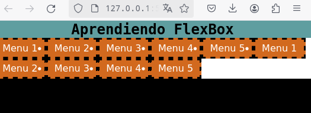

Por su parte grap-reverse modificaria el orden en el que lanza los componentes.

Podemos conbinar el flex-direction con el flex-wrap, utilizando flex-flow, al cual se le pasan dos valores, por ejemplo column para la direccion y ademas wrap para que lanze el li a la siguiente linea.

=>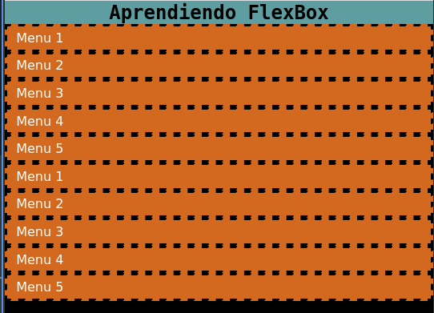

Hasta ahora vemos como mover elementos por el eje x u eje horizontal pero si necesitamos mover elementos por eje y o eje vertical utilizamos align-items.
Debemos recordar que para que esta propiedad se aplique correctamente el box debe ser mas grande que su children.

flex-end o flex-start;

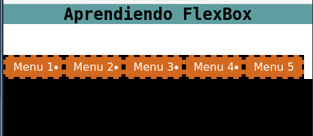 
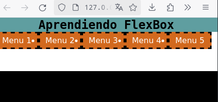

Utilizando las dos herramientas anteriormente mencionada logramos centrar un div dentro su box. 

.practica1{
  display: flex;
  justify-content: center;
  align-items: center;
}

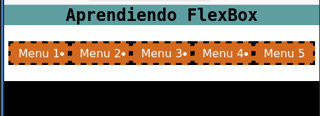

Baseline: la linea base de la fuente esta alineada, aunque puede hacerse por su parte superior o inferior con first baseline o last baseline.

Si aplicamos el siguiente cambio a un elemento veremos la diferencia.

last baseline:

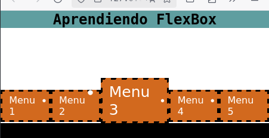

Si tenemos muchos elementos de tal manera que debemos utilizar el wrap para lanzarlo a la linea siguiente, podemos perdirle que a su vez ocupen el total del tamaño del box, y lo vemos con space-between donde los espacio no son entre elementos sino entre filas.

.practica1{
  display: flex;
  flex-wrap: wrap;
  align-content: space-between;

}

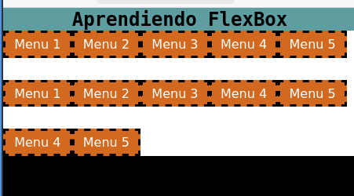

Asi mismo podemos utilizar los otros dos spaces- o strecht para no tener espacios residuales.

Si debemos darle espacio entre los elementos lo hacemos con el metodo gap (row o column o simplemente gap)

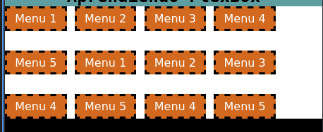

PERDIDA DE DATOS EN LOS ESTILOS.

Se da cuando el box termina siendo mas chico que el children.

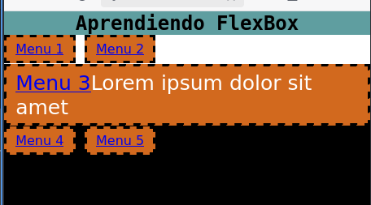

Vemos como el ancord esta fuera del contenido blanco. si pretenderiamos utilizar align-content para centra la informacion se comeria una parte del contendio. Para solucionarlmo utilizmos safe center.

PROPIEDADES QUE PUEDEN TOMAR LOS CHILDREN...

Si quisieramos que el quinto elemento este en orden 1:
.practica-1:nth-child(5){
  order: -3;
}

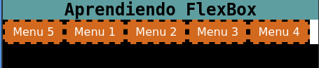

Si no queremos que quede espacio residual alguno entre los hijos, utilizamos flex-grow

.practica-1:nth-child(3){
  flex-grow: 1;
}

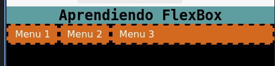

IMPORTANTE:
La propiedad flex-basis es muy util a la hora del diseño responsible dado que su tamaño se define antes de que se ocupe el espacio residual por ende cualquier alterior en el ancho o alto hara que se modifique el elemento para acomodarse a los parametros establecidos.

Por otro lado si estamos  a sacrificar a un elemento en pos de que otros mantegan su espacio deberiamos hacer lo siguiente:
si tenemos 3 hijos y queremos que el del medio se encoja y los otro dos no.
.practica-1{
  flex-grow: 1;
   flex-shrink: 0;
}
.practica-1:nth-child(2){
  flex-shrink: 1;
}

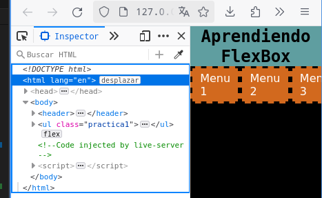

Si utilizamos simplemente flex y le damos tres valores se aplicaria cada valor en el siguiente orden, primero a grow, segundo a basis y tercero a shrink. Ej: flex: 1, 2 ,3

DISEÑO RESPONSIVE.

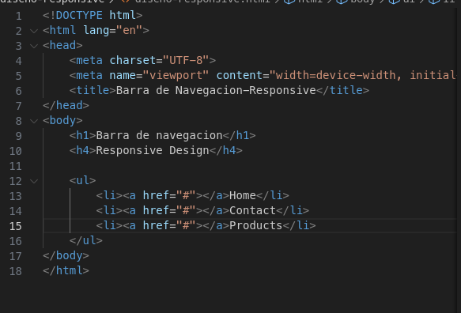

Por debajo de 480px:

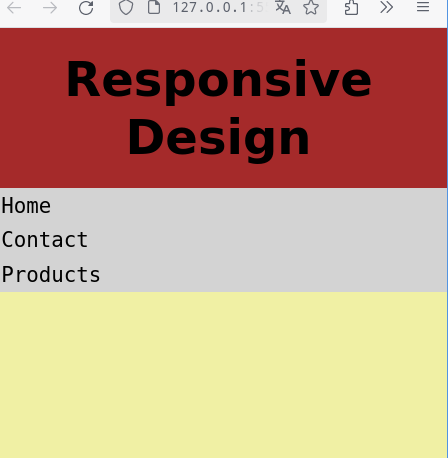

por debajo de 1024px:

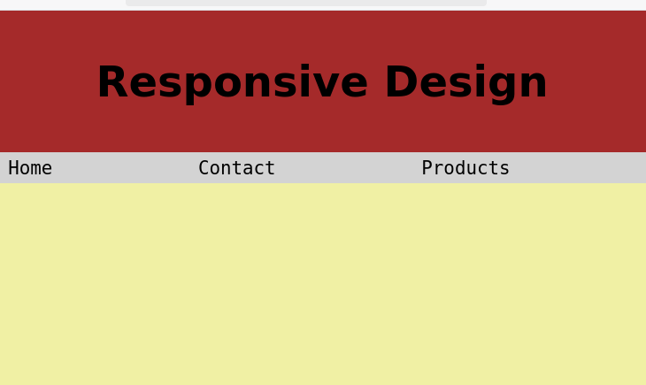

por encima de 1024px:

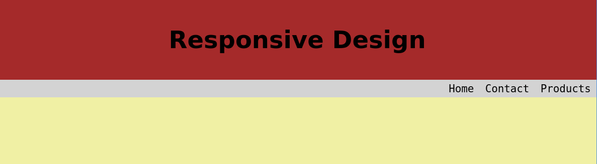

