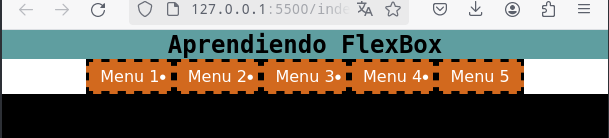

# Aprendiendo-Flexbox
HTML:

Sobre FLEXBOX:
configuracion inicial CSS:
*{
  margin:0;
  padding:0;
}

body{
  background-color: black;
  font-family: sans-serif;
}

/*PRIMER EJERCICIO*/
header{
  background-color: cadetblue;
}

h1{
  font-family: monospace;
  text-align: center;
}

.practica1{/*ul*/
 background-color: white;
}

.practica-1{/*li*/
  background-color: chocolate;
  color:white;
  border: dashed black;
  padding:.3rem .7rem;
}

.practica_1{/*a*/
  text-decoration: none;
  color:inherit;
}
OBTENIENDO => ;

LUEGO SE EJECUTARAN LO SIGUIENTES CAMBIOS.

Si en el li colocamos display: flex, vemos que todos los elementos se colocan uno a lado de otro por defecto(block)...;

Si queremos que ocupe solo el espacio de los hijos usamos inline-flex;

Se colocan en esta disposicion de manera predefinida porque utilizan el eje horizontal (x) del documento de manera que tal que la caja contenedora de las listas ocupa ese ancho y ese alto, pero si queremos cambiar la disposicion de ese eje utilizamos flex-direction, y podemos encontrar las siguientes configuraciones:
  -row(por defecto), aunque se puede cambiar la direccion de la fila con row-reverse => ;

  -column 
  
  =>  
  
  al igual que en el metodo anterior utilizando column-reverse, cambiamos horizontalmente el orden de los elementos 
  
  =>;

Para distribuir el espacio que queda luego de que el metodo flexbox ubique los elementos se debe usar justify-content:
la configuracion de la fila predeterminada es en el margen izquierdo de su box, pero si queremos modificarlo utilizamos flex-end
=>, y veremos que a diferencia de reverse, no se modifica el orden de los elementos;

Center: coloca el espacio residual al inicio al final del box 
=> ;
Space-between: el espacio residual esta entre los elementos 
=>;

Space-around: el espacio residual tambien esta se coloca en igual cantidad entre todos los elementos 
=>;
space-evenly: igual al anterior pero le quita las medidas padding para que la distribucion se mas perfecta
=> ;

Como podemos solucionar el problema de tener demasiados elementos en la misma linea:
Recordemos que por defecto el viewport tiene un ancho determinado, si excedemos dicho ancho con elementos se creara automaticamente una barra de desplazamiento. Si queremos evitar la aparicion de dicha barra podemos decirle que cada vez que un elemento exceda el ancho maximo se enviara los excedentes a la linea siguiente. 
A los fines practicos agregaremos mas elementos al html inicial.

